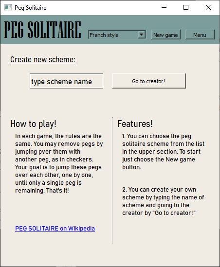
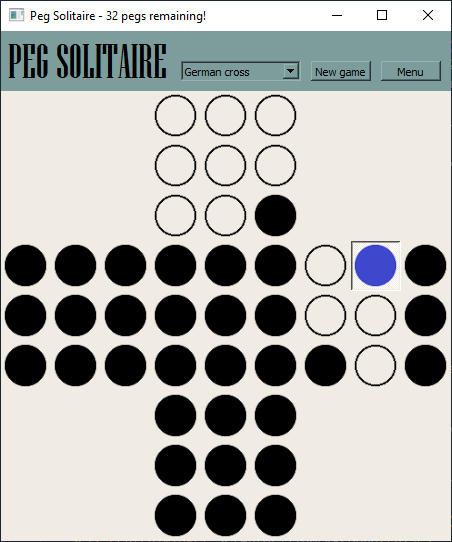
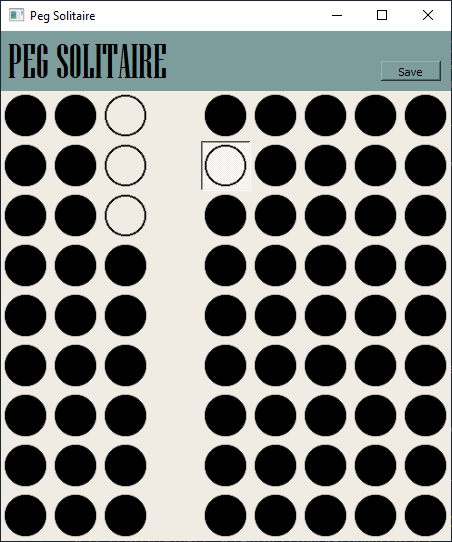

# PEG Solitaire
> It's GUI (PyQt) version of peg solitaire, a board game for one player.

## Table of contents
* [General info](#general-info)
* [Screenshots](#screenshots)
* [Technologies](#technologies)
* [Setup](#setup)
* [Features](#features)
* [Status](#status)

## General info
It was made to train Python skills. Peg solitaire is a single player game, base on a board game. You can choose from five different board schemes, including French style, German cross, Asymmetrical, Standard (English) and Diamont. This game also  features adding custom boards which you can save and play later!

## Screenshots

## Technologies
* Python 3.9
* PyQt, needs Python 3.9 to work properly!

## Setup
To run Peg Solitaire: 
* clone this repository to your computer
* run comand line from the cloned repository path
* if you don't have the PyQt, type:
>python -m pip install -r requirements.txt
* then type:
>python main.py

## Features
* English version.
* You can add your custom board schemes, though they are five standard one for you.

## Status
Ready to use.
